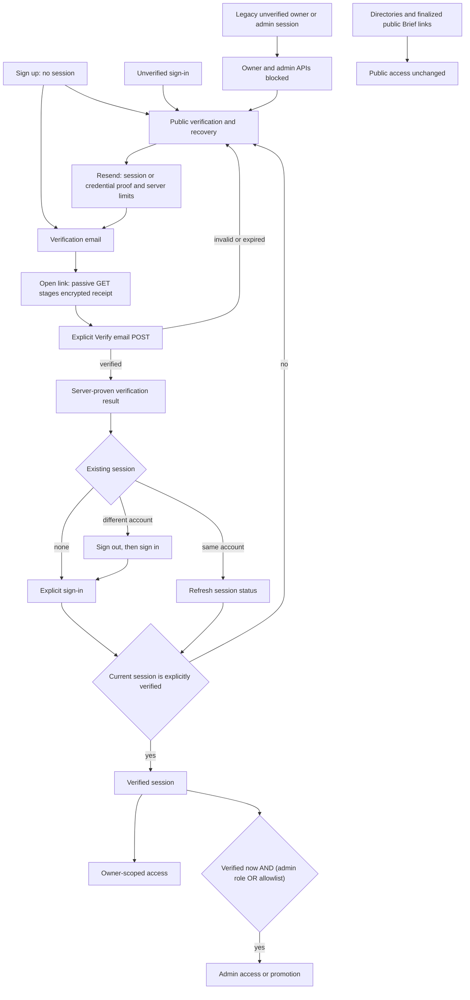

# Deploying TuringCare

End-to-end deploy on every push to `main`:

```
push main → ci → deploy-api (drain+full migrate+deploy+ready)
                    → migrate (idempotent verification) → deploy-web
```

- **Frontend** → Cloudflare Pages (`turingcare.dog`, `www.turingcare.dog`)
- **Backend** → Fly.io (`api.turingcare.dog`)
- **Database** → Supabase Postgres

Production deploys are serialized. One bounded API job drains the old machines,
applies the complete committed migration history through `0026`, deploys, restores
the prior machine count, and verifies readiness without a runner gap between phases.
Before migration begins, a failure restores the old release. Once migration is
attempted, any failure leaves the API drained for operator intervention because an
earlier migration may already have committed; the workflow never guesses that the
legacy schema is still safe. A separate migration job then idempotently verifies that
the deployed release left no pending migration.
The first deploy bootstraps one API machine when no prior machine exists. Health
checks use the stable `turingcare-api.fly.dev` hostname, so custom-domain
provisioning cannot block recovery. The web deploys only after the migrated API
is healthy and the migration tail has succeeded.

> First-time platform and secret setup below is manual. Once configured, the workflows
> automate deployment on `main`. Before merging verified-email enforcement, complete the
> blocking existing-account preparation in [section 6a](#6a-verified-email-ownership-cutover).

---

## 0. Prerequisites

- `flyctl` installed and logged in (`fly auth login`)
- A Cloudflare account with the `turingcare.dog` zone added
- A Supabase project
- `gh` CLI (optional, for setting GitHub secrets from the terminal)

The API package is `@turingcare/api` (pnpm filter name used everywhere below —
**not** `api`).

---

## 1. Database (Supabase)

1. Create/open the Supabase project.
2. Dashboard **`Connect`** button (or Project Settings → Database →
   Connection string) → choose the **Session pooler**. Copy it. Format
   (username is `postgres.<project-ref>`, port **5432**):
   `postgresql://postgres.<project-ref>:<url-encoded-password>@aws-1-<region>.pooler.supabase.com:5432/postgres`
   - Use the **Session pooler (5432)**, not Transaction pooler (6543): both are
     IPv4 (the direct `db.<ref>.supabase.co` connection is IPv6-only and
     unreachable from GitHub Actions / Fly), but the Session pooler has no
     PgBouncer prepared-statement caveat for `drizzle-kit migrate`.
   - **URL-encode** the password if it contains `@ : / ? # [ ] %` (e.g.
     `@`→`%40`). Reset it at Settings → Database → Database password if unknown.
3. This single value is used as `DATABASE_URL` in **both** the GitHub Actions
   secret (for both production migration phases) and the Fly secret (for the running API).
   It is **not** committed anywhere — secrets only.

No tables yet — the `deploy-api` and `migrate` jobs create them from
`apps/api/drizzle/` in the phases documented below on the first deploy.

---

## 2. Fly.io API app

### 2a. Create the app (no deploy yet)

From the repo root:

```bash
fly launch --no-deploy --name turingcare-api --config apps/api/fly.toml
```

- App name **`turingcare-api`** (must match `apps/api/fly.toml`'s `app`).
- Decline Postgres/Redis when prompted (we use Supabase).
- This generates `apps/api/fly.toml`.

### 2b. `fly.toml` + `Dockerfile.api` (already committed)

Both files are **already in the repo** (committed), so there's nothing to write
by hand — just confirm them:

- **`apps/api/fly.toml`** — `fly launch` generated it with the wrong region
  (`lax`) and port (`8080`) and no build section. It has been corrected to
  `primary_region = 'iad'`, `internal_port = 3001`, `[env] PORT = '3001'`, and
  `[build] dockerfile = '../../Dockerfile.api'`. **Change `primary_region` if
  you want a different region.**
- **`Dockerfile.api`** (repo root, build context = repo root) — runs the API
  with **`tsx`**, not `tsc` + `node dist`. This is deliberate and required: the
  project uses `moduleResolution: "Bundler"` (extensionless relative imports)
  and `@turingcare/shared` is consumed as TypeScript source — Node's native ESM
  loader can run neither, so `node dist/index.js` crashes with
  `ERR_MODULE_NOT_FOUND`. `tsx` transpiles + resolves both, exactly like local
  dev. Image health/readiness is not proof of the account journey: signup has no
  session, and `/me` requires a session established by verified sign-in.

`flyctl deploy --remote-only` builds the image on Fly's builders from
`Dockerfile.api`; `internal_port` (3001) matches the `PORT` the app binds via
`@hono/node-server` on `0.0.0.0`.

> If you ever want a leaner `node dist` image instead of `tsx`, that's a real
> change: switch the API tsconfig to `NodeNext`, add `.js` extensions to all
> relative imports, and add a build step to `@turingcare/shared` (emit JS +
> types, point its `exports` at `dist`). Out of scope for this deploy setup.

### 2c. Set Fly secrets

```bash
fly secrets set --app turingcare-api \
  DATABASE_URL='postgresql://postgres.<ref>:<url-encoded-pw>@aws-1-<region>.pooler.supabase.com:5432/postgres' \
  BETTER_AUTH_SECRET="$(openssl rand -base64 32)" \
  BETTER_AUTH_URL='https://api.turingcare.dog' \
  FRONTEND_URL='https://turingcare.dog' \
  COOKIE_DOMAIN='.turingcare.dog' \
  RESEND_API_KEY='re_...' \
  EMAIL_FROM='TuringCare <noreply@send.turingcare.dog>'
```

**Fly secrets and optional admin bootstrap configuration:**

| Secret | Value |
|---|---|
| `DATABASE_URL` | Supabase Session-pooler URL |
| `BETTER_AUTH_SECRET` | 32+ random chars (`openssl rand -base64 32`) |
| `BETTER_AUTH_URL` | `https://api.turingcare.dog` |
| `FRONTEND_URL` | `https://turingcare.dog` |
| `COOKIE_DOMAIN` | `.turingcare.dog` |
| `RESEND_API_KEY` | Resend API key (domain `send.turingcare.dog` verified) |
| `EMAIL_FROM` | `TuringCare <noreply@send.turingcare.dog>` |
| `ADMIN_EMAILS` (optional) | Existing comma-separated admin bootstrap allowlist; only controlled, ownership-verified accounts |

> `COOKIE_DOMAIN` was added during the deploy audit. The frontend and API are
> different subdomains, so without it Better Auth's default `SameSite=Lax`
> cookie is **not** sent on cross-site requests and login won't persist.
> Setting it makes Better Auth issue cross-subdomain `SameSite=None; Secure`
> cookies. Leave it **unset** locally.

### Transactional email (Resend) — one-time setup

Complete these steps before deploying. The production API now fails configuration
validation when `RESEND_API_KEY` is absent or blank, preventing Brief, verification,
or reset emails from being acknowledged without provider delivery. Local/CI no-key
mode emits only a redacted diagnostic with no recipient or subject.

1. Create a Resend account; create an API key.
2. In Resend, add domain `send.turingcare.dog`. Add the generated **SPF**,
   **DKIM**, and a **DMARC** record to Cloudflare DNS for `turingcare.dog`
   (Resend's dashboard shows the exact record names/hostnames to enter).
   Wait until Resend shows the domain **Verified**.
3. Set the Fly secrets:
   ```bash
   # (skip if you already set these in §2c)
   fly secrets set --app turingcare-api \
     RESEND_API_KEY='re_...' \
     EMAIL_FROM='TuringCare <noreply@send.turingcare.dog>'
   ```
4. Verify: trigger `/api/auth/request-password-reset` for a test account and
   confirm delivery (check Resend dashboard logs).

---

## 3. Cloudflare Pages project

Create the project **empty** (the workflow uploads builds; do not connect a Git
repo in the dashboard):

```bash
# Wrangler (npx wrangler), or Dashboard → Workers & Pages → Create → Pages →
# "Direct Upload". Project name MUST be exactly:
npx wrangler pages project create turingcare-web --production-branch main
```

Project name **`turingcare-web`** must match `--project-name` in `deploy.yml`.

---

## 4. Tokens

- **Fly:** `fly tokens create deploy -a turingcare-api` → `FLY_API_TOKEN`.
- **Cloudflare API token:** Dashboard → My Profile → API Tokens → Create →
  permission **Account › Cloudflare Pages › Edit** → `CLOUDFLARE_API_TOKEN`.
- **Cloudflare Account ID:** Dashboard → any domain → right sidebar →
  `CLOUDFLARE_ACCOUNT_ID`.

---

## 5. GitHub Actions secrets

Repo → Settings → Secrets and variables → Actions → New repository secret.

**GitHub Actions secrets required:**

| Secret | Value |
|---|---|
| `DATABASE_URL` | Supabase Session-pooler URL (used by both production migration phases) |
| `FLY_API_TOKEN` | from `fly tokens create deploy` |
| `CLOUDFLARE_API_TOKEN` | Pages-edit token |
| `CLOUDFLARE_ACCOUNT_ID` | Cloudflare account ID |

CLI:

```bash
gh secret set DATABASE_URL
gh secret set FLY_API_TOKEN
gh secret set CLOUDFLARE_API_TOKEN
gh secret set CLOUDFLARE_ACCOUNT_ID
```

---

## 6. Database rollout contract

`main` owns the immutable `0013–0021` migration history. Localization and Brief
concurrency/delivery migrations append to that history; never restore the old
colliding `0013–0015` filenames or rewrite an already-applied migration.

| Phase | Migration / action | Compatibility rule |
|---|---|---|
| Drained pre-deploy | Apply `0013–0021` | Personalized training, guided setup, contextual progress, and initial Brief-share privacy changes are schema-incompatible with the legacy API, so all old Fly machines stay drained. |
| Drained pre-deploy | Apply `0022_panoramic_skullbuster` | Adds the `locale` enum, nullable `user.locale`, and non-null/default-English `briefs.locale`. |
| Drained pre-deploy | Apply `0023_third_madripoor` | Repairs duplicate per-dog Brief versions under writer-blocking locks, then adds the `(dog_id, version)` unique constraint. |
| Drained pre-deploy | Apply `0024_brief_share_telemetry_privacy` | Broadens `0021`'s cleanup to encoded/case-variant public Brief bearer paths and mislabeled client events. |
| Drained pre-deploy | Apply `0025_petite_guardian` | Adds `brief_sends.delivered_at` and treats historical completed audits as delivered. |
| Drained pre-deploy | Apply `0026_first_nitro` | Adds durable delivery claims and a fail-closed delete trigger for claimed sends. |
| API | Deploy and verify `/ready` | Starts the locale-aware API with exact Brief binding, provider-idempotent retry recovery, and narrow legacy-payload compatibility. |
| Verify | Run full `db:migrate` | Idempotently proves the complete history is installed; no post-deploy tail is expected. |
| Web | Publish Cloudflare Pages | New clients require exact Brief and idempotency IDs; the already-deployed API keeps old tabs safe until this bundle replaces them. |

`pnpm --filter @turingcare/api db:migrate:predeploy` builds a temporary migration
set containing the complete journal. Its empty post-deploy allowlist is a fail-closed
declaration that every current migration runs while the API is drained. When adding a
later migration, explicitly classify its phase and update
`apps/api/src/db/migrate-predeploy.ts` plus the rollout contract tests; do not assume the
current all-predeploy classification remains safe.

The API must deploy before the web. It accepts exact new-client Brief IDs and a narrow
legacy `{ recipient, message }` payload. Legacy sends proceed only when one Brief version
can be established; an existing canonical audit may be replayed only within that one version.
Every multi-version ID-less request returns `client_upgrade_required` without provider I/O.
Delivery claims older than
30 seconds are retry-reclaimable with the same durable provider key, but the database
trigger blocks deletion for every non-null claim regardless of age. Operators recover a
stale or timestamp-less claim by retrying from the linked Brief screen, not by deleting
the audit row or weakening the trigger.

This release adds no locale environment variable or secret. Locale is a
validated request, account, and artifact value; keep `.env.example`, GitHub
secrets, and Fly secrets unchanged.

## 6a. Verified email ownership cutover

This is a behavioral cutover, not a database migration. Enforcement is unconditional when
the new API starts: new accounts have no session until verified sign-in, and existing
unverified sessions cannot read or mutate owner data or use admin privileges. Existing
data and persisted roles are retained. There is no grace period or bypass flag.

### Blocking preparation before merge

Merging to `main` starts the existing deployment sequence. An authorized operator must
complete and record these prerequisites before approving that merge:

1. Inventory affected accounts using aggregate information only. Record counts, the
   inspected release, date and operator; never publish account rosters, credentials,
   session cookies, email links or authored content.
2. Prove ownership of every controlled allowlisted/admin account and the dedicated
   non-admin smoke account through their real mailbox and the ordinary verification
   flow. Confirm authoritative verified status. Adding an address to `ADMIN_EMAILS`,
   holding a password or seeing a persisted admin role is not email-ownership proof.
3. Confirm production uses `NODE_ENV=production`, real email delivery is configured,
   and `E2E_TEST_MODE` is false. Production refuses captured-email mode.
4. Confirm the normal Fly edge supplies and overwrites a valid `fly-client-ip`. Credential,
   send and confirmation operations fail with `trusted_ip_required` if it is absent;
   do not substitute client-controlled `X-Forwarded-For`. Passive landing, session status
   and sign-out remain available so a proxy problem cannot trap a signed-in user.
5. Review the candidate's cross-origin cookie configuration. The API-host-only receipt
   is HttpOnly, Secure, SameSite=None and scoped to `/api/verification`; it is consumed
   only by credentialed API requests. Existing session `COOKIE_DOMAIN` settings remain
   unchanged. Rehearse on an isolated HTTPS candidate where available; actual production
   confirmation is part of the required post-deploy evidence below.

An authorized operator can obtain the basic inventory with this read-only query:

```sql
SELECT
  u.email_verified,
  u.role,
  count(*) AS accounts,
  count(*) FILTER (
    WHERE EXISTS (
      SELECT 1
      FROM public.session s
      WHERE s.user_id = u.id AND s.expires_at > now()
    )
  ) AS accounts_with_active_sessions
FROM public."user" u
GROUP BY u.email_verified, u.role
ORDER BY u.email_verified, u.role;
```

Privately reconcile configured allowlisted and smoke accounts with the controlled
mailboxes; do not add addresses or row-level data to deployment evidence. Do not update
verification flags, reset production passwords, change secrets or send bulk mail as
part of this inventory.

### Deployment and recovery

Preserve the existing API-first sequence: drain, apply committed migrations, deploy and
verify API readiness, idempotently verify migrations, then publish Pages. T1 adds no
migration and does not change that ordering.

Unverified owners use the public verification screen. Opening an email link only stages a
ten-minute encrypted receipt; the explicit **Verify email** action performs ownership
verification. Automated link scans and subresource loads cannot verify an account.
Re-confirming a valid link is idempotent; verification never automatically creates a
session or switches the active account. Expired receipts or links have a recovery path.

Rate-limited canonical verification GETs with a document destination or absent
`Sec-Fetch-Dest` receive a token-free 303 recovery redirect with the advertised wait.
Explicitly non-navigation verification requests retain JSON 429. The user can reopen the
email link afterward. Stalled verification-status checks reach retry feedback after eight seconds
instead of waiting indefinitely.

A user without a session supplies email and password to request another link; a legacy
session supplies its own identity. This permits useful provider-failure feedback without
an anonymous email-existence oracle. A successful resend means the provider accepted the
request, not that the inbox received it. Provider failures retain their send allowance;
the UI displays the server's retry delay rather than inviting immediate repeated sends.

Already-open old bundles may show a generic access failure or lack the new confirmation
screen during the API-to-web interval. They cannot perform protected server operations.
After Pages publication, reload to obtain the verification flow. A rollback to a
pre-confirmation web bundle is not a recovery strategy for this API.

If an address was mistyped, register a new account with the correct address. If it was
already registered, the original password still applies; use password recovery, then
verify normally. For a legacy account with data and an inaccessible mailbox, preserve the
account and escalate to a separately authorized ownership-recovery process. Do not
transfer data, change its email, or grant verification based solely on a claimed typo or
possession of its password.

Do not clear pending Brief delivery claims to unblock an unverified owner. The owner
first verifies, then uses the existing exact-version/idempotent retry and deletion
readiness flow. Retained data and delivery protections do not expire with a verification
or delivery-claim timer.

### Evidence required after cutover

Record the deployed API/web SHAs and bounded HTTPS browser outcomes: controlled signup
denied before confirmation; passive link opening still denied; explicit confirmation
plus sign-in allowed; legacy unverified owner and persisted-admin access denied; verified
admin and smoke access allowed; resend delay/failure recovery; expired link, password
recovery, sign-out, old-tab reload and English/Spanish continuation. Use dedicated
controlled fixtures. Do not manufacture legacy states by changing production flags or
attach real emails, tokens, cookies or owner data.

Exercise a pre-existing legacy session only when one is available and authorized. If
the inventory contains no affected legacy/admin accounts, record that aggregate fact
and cite the candidate's negative-case regression evidence; do not create an unsafe
production admin merely to demonstrate denial.

Confirm the existing retention job succeeds. New credential pairs perform a bounded
indexed cleanup page, and daily maintenance is the fallback. Only verification counters
inactive for more than 24 hours are deleted; enforcement windows remain 60 seconds.
The maintenance job queues briefly through ordinary cursor contention. A prolonged lock
timeout or `budget_exhausted` fails the invocation with safe diagnostics. After contention
ends, or when a scan needs another bounded pass, rerun the existing job and confirm
completion. Never truncate the rate-limit table.

Passing PR CI is not production deployment evidence. Keep T1's rollout status pending
until the authorized operator records these outcomes.

### Rollback constraints

Email ownership enforcement is forward-only. There is no T1 schema change to reverse.
Do not restore an API that permits unverified owner/admin access, add an administrative
grace path, or mark accounts verified in bulk. If recovery is broken, retain the gates,
use maintenance procedures as needed, and deploy a forward fix. Any later rollback must
remain within releases that preserve both verification and the existing Brief/migration
safety boundaries.



## 7. First deploy

Push to `main`. Watch the single serialized sequence through `ci`, `deploy-api`
(drain, predeploy migrations, deploy, readiness), `migrate`, and `deploy-web`.
Do not manually start a second rollout while it is running. On success: API at
the Fly app's `*.fly.dev`, frontend at the Pages `*.pages.dev`. Attach the real
domains next.

---

## 8. Custom domains (after the first successful deploy)

### API → `api.turingcare.dog` (Fly)

```bash
fly certs add api.turingcare.dog --app turingcare-api
```

In Cloudflare DNS for `turingcare.dog`:

- `CNAME  api  turingcare-api.fly.dev`  — **proxy status: DNS only (grey
  cloud)**. Fly terminates TLS; the orange cloud would break cert issuance.

Wait for `fly certs show api.turingcare.dog` to report the cert as issued.

### Frontend → `turingcare.dog` + `www` (Pages)

Cloudflare Pages → `turingcare-web` → **Custom domains** → add:

- `turingcare.dog`
- `www.turingcare.dog`

Pages manages these DNS records automatically (apex + `www`, proxied/orange is
fine for Pages).

Verify end-to-end with a controlled account: register, open its email link, explicitly
confirm ownership, then sign in and reach `/my/setup`. The session cookie is accepted
cross-subdomain by `api.turingcare.dog`; the separate verification receipt remains
API-host-only. Follow section 6a's privacy and evidence requirements.

---

## 9. Rollback

Only use a known-good release that preserves section 6a's email-ownership contract and
the migration/Brief constraints below. The pre-T1 API is not an authorized rollback target.

### API (Fly)

```bash
fly releases --app turingcare-api          # list versions (vN) + image refs
fly deploy --app turingcare-api --image <previous-image-ref> --config apps/api/fly.toml
```

Or Fly Dashboard → `turingcare-api` → **Monitoring → Releases →** select a
previous release → **Rollback**. (Schema rollbacks are separate: write a new
down migration; don't roll the API back past a schema change without it.)

Do not restore an API that can write Brief versions by an unlocked read-max after
`0023` is installed or one that cannot understand the delivery columns after `0025`/`0026`.
Prefer a forward fix. A schema rollback must be a new, reviewed migration; do not drop the
locale enum, either Brief uniqueness index, the claimed-send deletion guard, or attempt to
reverse the historical telemetry cleanup in `0021`/`0024`.

### Frontend (Cloudflare Pages)

Dashboard → Workers & Pages → `turingcare-web` → **Deployments** → pick the last
known-good deployment → **⋯ → Rollback to this deployment**. Instant; no rebuild.

The selected web release must support the enforcing API's explicit confirmation and
recovery endpoints. Do not restore the old soft-banner-only bundle.

---

## Quick reference

| Where | Secrets |
|---|---|
| GitHub Actions | `DATABASE_URL`, `FLY_API_TOKEN`, `CLOUDFLARE_API_TOKEN`, `CLOUDFLARE_ACCOUNT_ID` |
| Fly (`turingcare-api`) | `DATABASE_URL`, `BETTER_AUTH_SECRET`, `BETTER_AUTH_URL`, `FRONTEND_URL`, `COOKIE_DOMAIN`, `RESEND_API_KEY`, `EMAIL_FROM`; optional `ADMIN_EMAILS` |

| Name | Must equal |
|---|---|
| Fly app | `turingcare-api` (in `apps/api/fly.toml`) |
| Pages project | `turingcare-web` (in `deploy.yml`) |
| API domain | `api.turingcare.dog` |
| Frontend domains | `turingcare.dog`, `www.turingcare.dog` |
