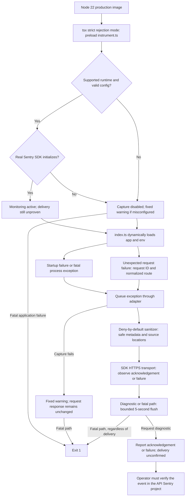

# API monitoring: runtime, diagnostics, and production acceptance

T2 is tracked by [issue #98](https://github.com/mcasillas17/TuringCare/issues/98).
The runtime and image gate are implemented. **Approved production deployment and
request/process capture evidence remain pending.** Local envelopes and passing PR CI
cannot prove that a deployed release reaches the API Sentry project.

## Runtime and evidence boundary

The API image, `.nvmrc`, package engine, and CI use **Node 22**. pnpm is pinned to
11.1.2 in `package.json`; install with `pnpm install --frozen-lockfile`. The current
lockfile resolves `@sentry/node` 10.69.0 and `tsx` 4.22.0.

At source revision `3859180`, the Dockerfile selected Node 26 while the adapter
permitted Sentry initialization only on Node 22. Rebuilding that source and running
its configured preload with a synthetic loopback DSN produced Node 26.8.1 and
`enabled: false`. The existing 81 targeted monitoring/workflow tests passed: they
mocked the SDK or checked source contracts. The image smoke supplied no Sentry
configuration, and PR CI did not build the image. Neither proved capture.

Node 22 restores the existing support contract. Keep the guard: the earlier
Sentry + tsx startup failure on newer Node versions is not resolved merely by
removing it. Any runtime/SDK/tsx change must pass the complete image gate before
changing the supported major. Keep TypeScript workspace source imports and the
instrumentation preload; `node dist/index.js` is not a supported launch path.



A request capture returns an event ID for queue acceptance. `flushSucceeded: true`
means the isolated diagnostic drained, observed an HTTP acknowledgement since
initialization, and observed no transport/sanitizer failure. It does **not** prove
Sentry stored, indexed, symbolicated, or alerted on that event. The CLI always labels
delivery `unconfirmed`; use the event itself for production acceptance. A previous
transport failure makes the adapter's flush result conservatively unsuccessful for
that process lifetime; the diagnostic always runs in a fresh process.

## Privacy and failure behavior

Events retain a full lowercase 40-character Git release SHA, fixed production
environment/application/method/status categories, registered route templates,
server-generated request IDs, fixed exception/mechanism classifications, source
positions, and validated debug IDs. API configuration rejects other release shapes.
Request IDs are fresh UUIDs generated by the API; inbound `X-Request-ID` values are
never forwarded or echoed, even if UUID-shaped. The response header, structured log,
and Sentry event share the generated ID. Routes come from Hono's registered templates,
never raw URLs or parameter values. Unknown exception names become a generic error;
identifier-shaped private text is not treated as safe metadata. Source filenames are canonical
repository-relative paths to existing regular TypeScript files under API/shared/i18n
source directories. Fixed Node built-in locations are retained; internal Node paths
are reduced to `node:internal`. Arbitrary function/module names, absolute paths,
unknown files, symlinks, source text, and frame variables are dropped.

Credentials, cookies, request bodies, email addresses, owner-authored content, raw
exception values, and public Brief bearer tokens are excluded. Breadcrumbs, tracing,
SDK log capture, and client reports are disabled. The image tests poison forwarded
fields and inspect the serialized envelope, including identifier-shaped private values
in approved fields and real errors with linked causes.

Missing or invalid configuration leaves normal startup network-free. Initialization,
capture, sanitizer, transport rejection/network errors, and failed/timed-out flushes
produce fixed warnings without raw configuration/error values. Startup failures
still exit 1, including missing production `RESEND_API_KEY`. Process failures use a
redacted fatal handler; strict-mode rejection notifications do not duplicate the
capture or print the raw rejection. No email fallback or Brief safeguards are changed.

## Reproduce the image gate locally

```bash
nvm use
pnpm install --frozen-lockfile
pnpm --filter @turingcare/api exec vitest run src/monitoring src/deploy-workflow.test.ts
docker build --file Dockerfile.api --tag turingcare-api:t2 .
scripts/smoke-api-monitoring-image.sh turingcare-api:t2
```

The gate uses the image's actual command for boot/startup failures, and its same
runtime/preload for CLI diagnostics. It mounts test fixtures and an ephemeral TLS
certificate, then runs with `--network none`. The real SDK/default HTTPS transport
sends only to an in-container loopback sink. It does not require Postgres or email;
full application boot uses only `/health`, which does not prove database readiness.
No real Sentry DSN, email key, application `.env`, or host proxy is inherited.

Expected: `PASS` lines for ordinary/configured boot, initialization, disabled/invalid
configuration, SDK-dropped events, request/startup/uncaught/rejection capture,
identifier-shaped private metadata,
sanitization, missing-Resend startup, HTTP rejection, disconnect, and stalled flush.
The final line reports Node 22 and 14 locally received envelopes. Each child process
has a 60-second outer bound; flush remains bounded at five seconds. Fixture certificates
and containers are removed on exit.

For Colima, set `DOCKER_CONTEXT` to your own context and
`TURINGCARE_SMOKE_TMPDIR` to an existing directory shared with that VM, for example
`$HOME/.cache/turingcare-image-smoke` after creating it. This only selects where the
throwaway certificate is created; it changes no monitoring transport configuration.

The existing broader gate, with your exported **disposable local** database/auth
settings, runs both ordinary health smoke and monitoring checks:

```bash
scripts/smoke-api-image.sh turingcare-api:t2
```

This wrapper uses host networking for the existing database-backed image environment;
the monitoring subprocess gate still has networking disabled. PR CI and the post-merge
Deploy workflow both build the image and invoke this wrapper. PR CI does not deploy.

## Operator-only commands

`pnpm --filter @turingcare/api monitoring:diagnostic MODE` is a CLI, never an HTTP
endpoint. The request mode makes one in-memory Hono request through the existing
request-ID/error-handler modules. It opens no listener, database, or email client.
Startup and process modes fail only their own isolated CLI process, not the serving API.

| Mode | Expected configured outcome |
|---|---|
| `status` | Prints Node version and `enabled: true`, sends no event, exits 0. This is not capture proof. |
| `request` | One synthetic 500, request/event IDs and `flushSucceeded: true`, exits 0. Verify the event externally. |
| `startup` | One fatal startup-tagged event, successful flush reports, exits 1 intentionally. |
| `uncaught` | One fatal process event, fixed stderr message, bounded flush, exits 1 intentionally. |
| `rejection` | Same fatal semantics for an unhandled promise rejection, one event, exits 1. |

Disabled monitoring or invalid usage exits 2. Request/startup diagnostic capture,
acknowledgement, flush, or deadline failure exits 3. Uncaught/rejection failures keep
exit 1 even when transport fails, so their exit code alone cannot prove capture.
The CLI has a 12-second deadline after preload; use an outer `timeout 60s` to bound
package-manager/preload startup too. An outer timeout (124) is a failed diagnostic.

## Approved production acceptance — still pending

**Obtain separate operator authorization before deployment, secret changes, or any
real diagnostic event.** These commands are instructions, not evidence of execution.
Do not inspect owner records or deliberately crash the serving process.

1. Identify the approved merged release SHA and immutable image reference. Confirm
   passing PR CI, then separately confirm the serialized post-merge Deploy workflow
   and `/ready`. Record the selected running Fly machine and image reference.
2. Configure the **API** Sentry project's HTTPS DSN and `SENTRY_ENVIRONMENT=production`
   through the approved Fly secret-management procedure. Do not put credentials in
   source, issue text, shell history, or test fixtures. The Deploy workflow supplies
   `SENTRY_RELEASE="$GITHUB_SHA"` as runtime configuration. Remove a stale
   `SENTRY_RELEASE` Fly secret during the approved cutover if one exists, because a
   [secret precedence](https://fly.io/docs/reference/configuration/#the-env-variables-section)
   can hide the deployment's release value. Never remove `RESEND_API_KEY`.
3. In a Bash shell, set the public release/machine identifiers and validate the
   release shape before using the following commands:

   ```bash
   APPROVED_RELEASE='replace-with-the-approved-40-character-merged-commit-sha'
   MACHINE_ID='replace-with-the-selected-running-machine-id'
   [[ "$APPROVED_RELEASE" =~ ^[0-9a-f]{40}$ ]] || exit 2

   flyctl ssh console --app turingcare-api --machine "$MACHINE_ID" --command \
     "/bin/sh -lc 'cd /app/apps/api && test \"\$SENTRY_RELEASE\" = \"$APPROVED_RELEASE\" && timeout 60s pnpm monitoring:diagnostic status'"
   ```

   Expected: Node 22, `enabled: true`, exit 0. The release comparison must succeed;
   it does not print configured values. Investigate failure before sending anything.
4. Run one controlled request and one controlled process diagnostic from that same
   approved running image (each command creates a separate process):

   ```bash
   flyctl ssh console --app turingcare-api --machine "$MACHINE_ID" --command \
     "/bin/sh -lc 'cd /app/apps/api && test \"\$SENTRY_RELEASE\" = \"$APPROVED_RELEASE\" && timeout 60s pnpm monitoring:diagnostic request'"

   flyctl ssh console --app turingcare-api --machine "$MACHINE_ID" --command \
     "/bin/sh -lc 'cd /app/apps/api && test \"\$SENTRY_RELEASE\" = \"$APPROVED_RELEASE\" && timeout 60s pnpm monitoring:diagnostic uncaught'"
   ```

   Request exits 0 with a correlation/event ID; process diagnostic intentionally exits
   1. An SSH failure can also be nonzero: inspect the fixed diagnostic output and the
   actual Sentry event. `startup` and `rejection` can be used similarly when separately
   approved. Do not repeatedly send diagnostics to chase missing evidence.
5. In the API Sentry project, verify the request and process events from this run.
   Require the exact release, production environment, safe source stack, one event per
   diagnostic, and expected tags: request route `/operator-diagnostic`, status 500 and
   printed request ID; process route `process`, status 500 and request ID `process`.
   Inspect the event payload for the forbidden data categories above. Confirm normal
   API health after the diagnostic.
6. Attach the approval, implementation/merge SHA, image reference, running Node/release
   proof, CI/CD results, sanitized request/process event references and timestamps to
   #98. Update the T2 roadmap status with that evidence. Until both controlled events
   reach Sentry from the approved running image, T2's production gate stays open.

## Disablement and rollback

Monitoring can be disabled by removing `SENTRY_DSN` through an approved configuration
change; incomplete monitoring configuration may log a fixed warning while the API
continues. This is an explicit monitoring outage, not successful verification.

Prefer a forward fix or a previously validated Node 22 image. Rolling back to a Node 26
image restores the known disabled-monitoring state. A runtime rollback must also preserve
current auth and schema compatibility, production Resend enforcement, and Brief
delivery/deletion guarantees; follow [DEPLOY.md](../../DEPLOY.md#9-rollback). Never remove
the runtime guard or weaken application startup validation to make a smoke pass.
